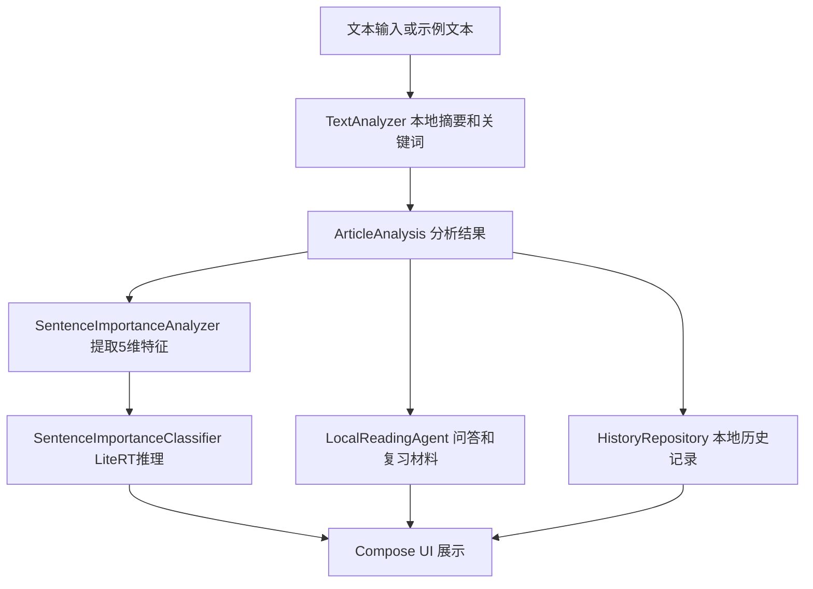

# SmartRead Agent 软件详细设计说明书（初稿）

## 文档信息

| 项目 | 内容 |
|---|---|
| 项目名称 | SmartRead Agent：AI 智读助手 |
| 文档版本 | v1.0 初稿 |
| 编写日期 | 2026-06-29 |
| 课程名称 | 软件项目研发实践（3） |
| 指导老师 | 林立老师 |
| 演示顺序 | 第4组，2026-07-01 9:50-10:05，计网大楼 202 |
| 小组成员 | 林立洲（121072021030）、江轩宇（121052023075） |
| 适用范围 | 课程期末演示、详细设计说明书提交、项目复盘 |

## 修订记录

| 版本 | 日期 | 修订内容 | 修订人 |
|---|---|---|---|
| v0.1 | 2026-05-11 | 项目立项、目录和版本管理初始化 | 林立洲 |
| v0.2 | 2026-05-12 | 完成文本输入、本地摘要和关键词 MVP | 林立洲 |
| v0.3 | 2026-05-12 | 增加 Agent 问答、知识卡片和复习题 | 林立洲 |
| v0.4 | 2026-05-12 | 集成 LiteRT 端侧句子重要性分析模型 | 林立洲 |
| v0.5 | 2026-05-12 | 增加本地历史记录保存、恢复和清空 | 林立洲 |
| v1.0 | 2026-05-13 | 收口期末演示稳定版、APK、截图和说明材料 | 林立洲、江轩宇 |

## 目录

1. 引言
2. 项目概述
3. 总体设计
4. 模块详细设计
5. 核心算法与模型设计
6. 数据结构设计
7. 界面设计
8. 测试设计
9. 部署与运行
10. 项目总结与后续优化

## 1 引言

### 1.1 编写目的

本说明书用于记录 SmartRead Agent V1.0 期末演示稳定版的详细设计。文档面向《软件项目研发实践（3）》课程期末考核，重点说明系统的功能范围、模块划分、数据结构、端侧机器学习模型、界面流程、测试情况和部署方式。它不是商业产品发布文档，而是课程项目在完成移动端 AI 应用开发后，对设计和实现过程的一次整理。

本项目已经完成课程演示用 debug APK，文件位于 `release/SmartReadAgent-v1.0-debug.apk`。该 APK 用于课堂验收、真机测试和现场演示，不用于应用商店正式商业发布。文档中涉及的 OCR、云端大模型增强、Room 数据库和正式签名 release 包均作为后续优化方向，不写成当前已经实现的功能。

### 1.2 项目背景

在日常学习中，学生经常需要阅读教材段落、课堂讲义、技术文章和项目资料。资料内容往往较长，手工划重点、写摘要、整理复习题会消耗较多时间。SmartRead Agent 的设计出发点是做一个轻量的移动端阅读辅助工具，让用户在手机上粘贴或选择示例文本后，快速得到摘要、关键词、分点摘要和复习材料。

课程评分中机器学习在应用中的整合程度占比较高，因此项目没有停留在简单文本处理 Demo，而是在 V0.4 阶段加入 LiteRT / TensorFlow Lite 端侧句子重要性分析。模型文件随 APK 放入 Android assets，运行时在本地加载并推理，体现移动端机器学习应用的完整链路。

### 1.3 读者对象

本文档主要面向课程指导老师、参与评分的班委和组长、小组成员，以及后续查看项目的同学。读者不需要提前了解完整代码，但应能通过本文档理解系统由哪些模块组成、各模块如何协作、机器学习部分如何接入 Android 应用。

### 1.4 参考资料

- Android 官方文档与 Kotlin 语言基础资料。
- Jetpack Compose UI 开发资料。
- TensorFlow Lite / LiteRT Android 推理相关资料。
- 项目仓库中的 `README.md`、`docs/技术方案.md`、`docs/V0.4_LiteRT端侧模型集成说明.md`。
- 课程文件：`2023级软工期末考核说明.pdf`、`2023级软工期末课程演示流程.pdf`、`2023级期末演示评分表.xlsx`。

### 1.5 术语说明

- LiteRT / TensorFlow Lite：用于移动端和端侧设备的轻量模型推理框架。
- 本地规则型阅读 Agent：本项目当前版本的 Agent 形式，不调用 GPT API，不依赖云端大模型，而是根据当前文章的摘要、关键词、分点摘要和复习题规则进行问答。
- 端侧推理：模型在手机本地运行，不把文本上传到服务器。
- APK：Android 安装包，本项目 V1.0 使用 debug APK 进行课程演示。

## 2 项目概述

### 2.1 系统目标

SmartRead Agent 的目标是完成一个可运行、可演示、能体现移动端机器学习能力的 Android 应用。系统需要支持文本输入与示例文本、自动摘要、关键词提取、分点摘要、LiteRT 句子重要性分析、Agent 问答、知识卡片、复习题和历史记录。它的核心价值不是做一个大而全的学习平台，而是在短时间内帮助用户完成“读文章、抓重点、问问题、复习回看”的闭环。

### 2.2 应用场景

典型场景包括：学生阅读课程讲义时先用 App 得到摘要；阅读技术文章时快速提取关键词和重点句；复习前用知识卡片和复习题检查理解；课堂演示时使用示例文本稳定展示各功能。由于当前能力主要在本地运行，现场演示时不依赖网络，能够降低环境不确定性。

### 2.3 功能范围

V1.0 已实现的功能包括：文本输入、示例文本、一句话总结、关键词、分点摘要、LiteRT 端侧句子重要性分析、本地规则型阅读 Agent 问答、知识卡片、复习题、本地历史记录保存、历史记录恢复和清空历史记录。

V1.0 未实现的功能包括：用户登录、云端同步、OCR 图片识别、语音输入、多设备同步、正式商业发布包、服务端接口和云端大模型 API。这些内容不在当前演示范围内，后续可以作为扩展方向。

### 2.4 非功能需求

系统需要满足稳定演示、离线可用、操作路径短、界面信息清晰、模型加载失败可兜底、APK 可安装和主要流程可复现等要求。由于演示时间只有 15 分钟，功能入口必须集中，演示文本必须提前准备，手机端操作不能依赖复杂配置。

## 3 总体设计

### 3.1 系统总体架构

系统采用单体 Android 应用结构，核心代码集中在 `android/app/src/main/java/com/smartread/agent/`。界面层使用 Jetpack Compose 编写；分析层由 TextAnalyzer、SentenceImportanceAnalyzer、LocalReadingAgent 和 HistoryRepository 等对象承担；模型推理由 SentenceImportanceClassifier 封装；模型文件位于 `android/app/src/main/assets/sentence_importance_model.tflite`。



### 3.2 Android 端架构

Android 工程使用 Gradle 管理，应用入口为 `MainActivity`。UI 通过 Compose 的状态驱动方式实现：用户输入文本后点击“开始智能分析”，界面状态更新为 ArticleAnalysis，摘要结果、LiteRT 结果和功能入口随状态显示。页面切换使用内部枚举 `Screen` 控制，包括 Home、AgentChat、KnowledgeCards 和 History。

### 3.3 模块划分

系统主要划分为七个模块：文本输入模块、本地摘要与关键词模块、LiteRT 端侧分析模块、Agent 问答模块、知识卡片与复习题模块、历史记录模块、UI 展示模块。模块之间通过 ArticleAnalysis 等数据结构传递结果，避免每个页面重复解析原文。

### 3.4 数据流设计

用户输入原文后，TextAnalyzer 先完成句子切分、关键词评分和摘要生成，得到 ArticleAnalysis。随后 SentenceImportanceAnalyzer 读取 ArticleAnalysis 中的原文和关键词，为文章前几句提取特征，并调用 SentenceImportanceClassifier 生成句子重要性分数。用户进入 Agent 或知识卡片页面时，LocalReadingAgent 基于同一份 ArticleAnalysis 生成回答、卡片和复习题。用户完成分析后，HistoryRepository 将结果保存到 SharedPreferences；从历史记录恢复时，再把历史原文交给分析流程重新生成当前页面状态。

### 3.5 版本迭代过程

项目按小版本逐步推进。v0.1 完成立项和仓库初始化；v0.2 做出摘要 MVP；v0.3 加入 Agent 问答和知识卡片；v0.4 完成 LiteRT 端侧模型集成；v0.5 加入本地历史记录；v1.0 冻结功能范围，整理 APK、截图、测试记录、演示材料和课程文档。这样的迭代方式使项目可以在每个阶段都有可运行成果，而不是最后一次性堆功能。

## 4 模块详细设计

### 4.1 文本输入模块

模块职责：提供待分析文本输入、示例文本选择、清空文本和开始分析入口。输入为用户粘贴的原文或内置 SampleTexts；输出为传递给 TextAnalyzer 的字符串。核心界面由 Compose 的 OutlinedTextField、Button 和状态变量组成。

处理流程：用户打开 App 后，首页显示文本输入框、示例按钮和分析按钮。点击示例文本时，输入框填入预设内容；点击开始智能分析时，系统校验文本是否为空，非空则进入分析流程，空文本则保留友好提示。异常处理重点是空文本、过短文本和现场误操作，不让 App 因输入问题崩溃。

### 4.2 本地摘要与关键词模块

模块职责：从原文中生成一句话总结、关键词和分点摘要。输入为原始文本；输出为 ArticleAnalysis 中的 oneSentenceSummary、keywords、bulletSummaries、sentenceCount 和 characterCount。核心对象为 `TextAnalyzer`。

处理流程：TextAnalyzer 使用正则切分句子，对领域词、英文技术词和中文短语进行评分，结合关键词命中、句子长度和句子位置给句子打分。得分最高的句子作为一句话总结，若干高分句子按原文顺序整理为分点摘要。异常处理包括文本为空返回 null、句子切分失败时截取原文前段作为兜底、关键词为空时提供默认关键词。

### 4.3 LiteRT 端侧句子重要性分析模块

模块职责：展示移动端机器学习能力，对文章中的句子给出重要性评分。输入为 ArticleAnalysis、关键词和句子位置；输出为 SentenceImportance 列表，包含句子、分数、等级、来源和索引。核心对象为 `SentenceImportanceAnalyzer` 和 `SentenceImportanceClassifier`。

处理流程：SentenceImportanceAnalyzer 对文章前 5 个句子提取 5 维特征：句子长度归一化、关键词重合度、位置分数、标点提示分数、总结提示词分数。SentenceImportanceClassifier 加载 assets 中的 `sentence_importance_model.tflite`，用 TensorFlow Lite Interpreter 推理，输出 0 到 1 的分数。分数大于等于 0.70 标为高，0.40 到 0.70 标为中，低于 0.40 标为低。

异常处理：如果模型文件不存在、Interpreter 初始化失败或推理异常，系统使用 fallbackScore 规则评分，并在结果来源中显示规则评分兜底。这样即使现场手机环境出现模型加载问题，摘要和演示流程仍能继续。

### 4.4 Agent 问答模块

模块职责：围绕当前文章分析结果回答用户问题。输入为用户问题和 ArticleAnalysis；输出为 Agent 回答文本。核心对象为 `LocalReadingAgent`，当前版本统一表述为“本地规则型阅读 Agent”。

处理流程：LocalReadingAgent 对问题进行意图识别，判断问题是否属于“文章主要讲什么”“关键词”“复习重点”“生成复习题”“知识卡片”等类型。不同意图调用 ArticleAnalysis 中的摘要、关键词、分点摘要或复习题生成逻辑组织回答。它不调用 GPT API，不依赖云端大模型，也不需要网络。

异常处理：如果用户尚未完成文章分析，Agent 会提示先输入文章并完成分析；如果用户提交空问题，会提示输入问题；如果问题不属于已知意图，则返回一个包含总结、关键词和分点摘要的综合回答。

### 4.5 知识卡片与复习题模块

模块职责：把分析结果转换成适合复习的卡片和题目。输入为 ArticleAnalysis；输出为 KnowledgeCard 列表和 QuizQuestion 列表。核心函数为 `generateKnowledgeCards` 和 `generateQuizQuestions`。

处理流程：知识卡片通常包括概念卡、核心观点卡和复习卡。复习题根据一句话总结、关键词和分点摘要生成简答题及参考答案。该模块的设计目的是把“读完文章得到摘要”推进到“能回看和复习”的阶段，提高 App 的完整度。

异常处理：如果没有分析结果，页面显示友好提示，不生成空卡片；如果分点摘要不足，则用一句话总结作为参考答案来源。

### 4.6 历史记录模块

模块职责：保存最近分析过的文章和结果，支持回看、恢复和清空。输入为 ArticleAnalysis；输出为 HistoryRecord 列表。核心对象为 `HistoryRepository`。

处理流程：每次分析完成后，系统把标题、预览、保存时间、原文、摘要、关键词、句子数和字符数写入 JSON，并存入 SharedPreferences。最多保留最近 12 条记录，重复原文会去重。用户点击历史记录中的恢复按钮时，系统取出原文并重新执行分析流程。

异常处理：如果 SharedPreferences 中的 JSON 解析失败，返回空列表；清空历史记录时写入空数组，避免残留脏数据影响演示。

### 4.7 UI 展示模块

模块职责：把输入区、结果区、LiteRT 区域、Agent 页面、知识卡片页面和历史页面组织成完整移动端体验。输入为各模块状态；输出为用户可操作界面。核心实现集中在 Compose 组件中。

处理流程：Home 页面负责输入和结果展示；AgentChat 页面负责快捷问题、手动提问和聊天记录；KnowledgeCards 页面负责展示卡片和复习题；History 页面负责展示最近记录、恢复和清空。UI 使用卡片式布局、分区标题和按钮入口，保证演示时老师能快速看到功能点。

## 5 核心算法与模型设计

### 5.1 本地摘要算法

本地摘要算法使用轻量规则实现，优点是稳定、可解释、无需网络。算法先切分句子，再统计关键词命中情况。句子得分由关键词命中、句子长度和位置共同决定。第一句通常有较高位置权重，中等长度句子更适合作为摘要候选。最终系统选择得分最高的句子作为一句话总结，再选择若干高分句子生成分点摘要。

这种方法不追求大型语言模型级别的自然语言生成效果，但非常适合课程项目演示。它能在没有网络和 API Key 的情况下稳定运行，也能让老师看到算法逻辑和代码实现，而不是只展示一个外部服务调用结果。

### 5.2 关键词提取算法

关键词提取结合三类线索：项目内置领域词、英文技术词和中文短语窗口。领域词包括 SmartRead、Agent、Android、Kotlin、Compose、LiteRT 等项目相关词，也包括摘要、关键词、知识卡片、问答、历史记录、模型等阅读分析词。英文技术词通过正则提取，中文短语通过双字窗口统计并过滤停用词。最终按分数排序，并避免包含关系过强的重复词。

### 5.3 LiteRT 模型设计

LiteRT 模型名称为 `sentence_importance_model`，输入形状为 `[1, 5]`，输出形状为 `[1, 1]`。模型特征为 `sentenceLengthNorm`、`keywordOverlapScore`、`positionScore`、`punctuationScore`、`summaryCueScore`。模型结构为 `Input(5) -> Dense(8, relu) -> Dense(4, relu) -> Dense(1, sigmoid)`，输出为 0.0 到 1.0 的句子重要性分数。

项目中的模型文件大小约 1496 字节，SHA256 为 `11462553e040257c11677bc7824021440761922ff4a8b3ced2bb7d21904b9dde`。训练摘要中记录的 weak label accuracy 为 0.9260，但这只是弱监督标签上的训练参考指标，演示时不把它夸大为真实业务准确率。该模型的作用是展示端侧模型集成和句子评分流程。

### 5.4 端侧推理流程

端侧推理流程如下：App 读取原文并生成 ArticleAnalysis；SentenceImportanceAnalyzer 取前 5 个句子；每个句子提取 5 维特征；SentenceImportanceClassifier 读取 assets 中的 .tflite 文件；Interpreter 执行推理；系统把输出分数转换为等级；界面展示句子、分数、等级和来源。模型加载失败时进入 fallbackScore，不中断主流程。

### 5.5 本地规则型 Agent 设计

本项目 Agent 当前版本没有调用 GPT API，也没有依赖云端大模型。它是本地规则型阅读 Agent，基于当前文章分析结果进行回答。它使用问题意图识别把用户输入映射到几个可解释动作：概括文章、提取关键词、整理复习重点、生成复习题、生成知识卡片和综合回答。这样设计的好处是离线可用、稳定、可控，也能避免课堂现场因为网络或 API 配置失败而影响演示。

## 6 数据结构设计

### ArticleAnalysis

ArticleAnalysis 是主分析结果结构，字段包括 originalText、oneSentenceSummary、keywords、bulletSummaries、sentenceCount、characterCount、sentenceImportances 和 localModelStatus。它把文本分析结果集中保存，供首页、Agent、知识卡片和历史记录模块复用。

### SentenceImportance

SentenceImportance 表示单个句子的端侧评分结果，字段包括 sentence、score、level、source 和 index。score 是模型或兜底规则输出的分数，level 是高、中、低，source 用于说明结果来自 LiteRT 本地模型还是规则评分兜底。

### ChatMessage

ChatMessage 用于 Agent 问答页面，字段包括 role 和 content。role 使用 MessageRole 区分 USER 和 AGENT。该结构让界面能够按用户消息和 Agent 回答分别展示气泡。

### KnowledgeCard

KnowledgeCard 用于知识卡片页面，字段包括 title、type 和 content。title 表示卡片标题，type 表示概念、观点或复习等类别，content 是卡片正文。

### QuizQuestion

QuizQuestion 用于复习题展示，字段包括 question 和 referenceAnswer。当前版本以简答题为主，参考答案来自摘要、关键词和分点摘要。

### HistoryRecord

HistoryRecord 用于历史记录，字段包括 id、title、preview、savedAt、displayTime、originalText、oneSentenceSummary、keywords、sentenceCount 和 characterCount。它兼顾列表展示和恢复分析所需数据。

## 7 界面设计

### 7.1 首页

首页展示项目名称、版本说明、文本输入区、示例文本按钮、开始分析按钮、清空按钮、字符数和句子数。截图参考：`screenshots/app/V1.0首页_20260512.png`。

### 7.2 文本输入区

文本输入区支持粘贴或选择示例文本，提示建议输入 100 字以上。演示时为了稳定，优先使用示例文本。截图参考：`screenshots/app/V1.0文本输入_20260512.png`。

### 7.3 摘要结果区

摘要结果区展示一句话总结、关键词、分点摘要和入口按钮。截图参考：`screenshots/app/V1.0摘要结果_20260512.png`。

### 7.4 LiteRT 分析区

LiteRT 区域展示推理方式、句子重要性等级、分数和来源，是演示中机器学习整合的重点。截图参考：`screenshots/app/V1.0LiteRT端侧分析_20260512.png`。

### 7.5 Agent 问答页

Agent 页面展示当前文章摘要、快捷问题、聊天记录和手动提问输入框。截图参考：`screenshots/app/V1.0Agent问答_20260512.png`、`screenshots/app/V1.0Agent快捷问题_20260512.png`。

### 7.6 知识卡片页

知识卡片页面展示概念卡、核心观点卡、复习卡和复习题。截图参考：`screenshots/app/V1.0知识卡片_20260512.png`、`screenshots/app/V1.0复习题_20260512.png`。

### 7.7 历史记录页

历史记录页展示最近保存的分析，支持恢复历史分析和清空历史记录。截图参考：`screenshots/app/V1.0历史记录页_20260512.png`、`screenshots/app/V1.0历史记录恢复_20260512.png`。

## 8 测试设计

### 8.1 测试环境

开发环境为 Windows + Android Studio / Gradle，Android 工程使用 Kotlin 和 Jetpack Compose。模拟器测试使用 Pixel_8 Android 模拟器；真机测试使用安卓手机安装 V1.0 debug APK。APK 文件位于 `release/SmartReadAgent-v1.0-debug.apk`。

### 8.2 测试用例

测试覆盖 App 启动、示例文本输入、手动文本输入、开始智能分析、空文本提示、摘要结果展示、关键词展示、LiteRT 区域展示、Agent 快捷问题、Agent 手动提问、知识卡片、复习题、历史记录保存、历史记录恢复和清空历史记录。

### 8.3 测试结果

V1.0 阶段模拟器测试和真机体验反馈均表明主要演示流程可用。示例文本能够生成摘要，LiteRT 分析区域能够显示，Agent 问答、知识卡片、复习题和历史记录均可进入。当前没有记录影响现场演示的阻塞性 Bug。

### 8.4 Bug 与优化建议

当前主要优化建议包括：摘要算法仍偏轻量，后续可引入更强的抽取式或生成式方法；LiteRT 模型训练数据规模有限，后续可扩充真实标注数据；历史记录当前使用 SharedPreferences，后续可迁移到 Room；正式发布时需要生成正式签名 release 包；如果需要处理图片资料，可增加 OCR 导入。

## 9 部署与运行

### 9.1 Android Studio 构建

Android 工程位于 `android/`。构建命令为：

```powershell
cd android
.\gradlew.bat :app:assembleDebug
```

### 9.2 APK 安装

课程演示 APK 位于 `release/SmartReadAgent-v1.0-debug.apk`。安卓手机安装时需要允许当前应用安装未知来源应用。该 APK 是课程演示用 debug APK，不作为应用商店正式商业发布版。

### 9.3 GitHub/Gitee 仓库

项目使用 Gitee 和 GitHub 进行版本管理，保留了 main、dev、feature 分支和 v0.1 到 v1.0 的阶段记录。仓库用于展示源码、提交记录、标签和 Release 材料。

### 9.4 演示环境

期末演示时间为 2026-07-01 9:50-10:05，地点为计网大楼 202。建议 12 分钟完成 PPT 和 App 演示，预留 3 分钟回答问题。林立洲负责 PPT 汇报和技术说明，江轩宇负责安卓手机实际操作演示。现场准备手机、APK、PPT、模拟器备份、截图备份和答辩问题。

## 10 项目总结与后续优化

SmartRead Agent V1.0 已经完成课程期末演示所需的核心能力：它能运行在 Android 端，能通过示例文本稳定展示摘要、关键词、分点摘要、LiteRT 端侧分析、Agent 问答、知识卡片、复习题和历史记录。项目最重要的特点是把移动端应用和端侧机器学习结合起来，而不是只做普通文本处理页面。LiteRT 模型虽然轻量，但已经走通了特征提取、模型导出、Android assets 集成、本地推理和 UI 展示的完整流程。

从项目分工看，林立洲主要承担选题、技术方案、Android 核心开发、LiteRT 集成、版本管理、文档和汇报材料整理；江轩宇主要承担需求反馈、真机安装体验、功能流程验证、UI 使用建议、文档校对和现场演示操作。这样的分工符合双人小组的实际情况，也能在演示中清楚说明各自贡献。

后续如果继续完善，可以从四个方向推进。第一，扩充 LiteRT 模型训练数据，用更真实的阅读材料和人工标注提升句子重要性判断效果。第二，完善数据存储，把 SharedPreferences 迁移到 Room 数据库，支持更完整的历史记录管理。第三，加入 OCR 或文件导入，让用户能从图片、PDF 或课堂讲义中导入文本。第四，在保持本地能力稳定的基础上，接入云端大模型作为增强问答能力，但必须明确这是后续增强，不是当前 V1.0 已实现内容。
